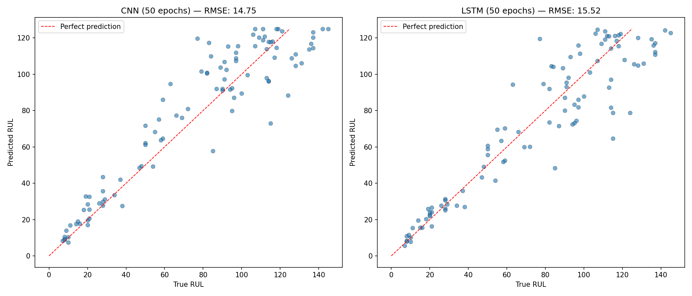
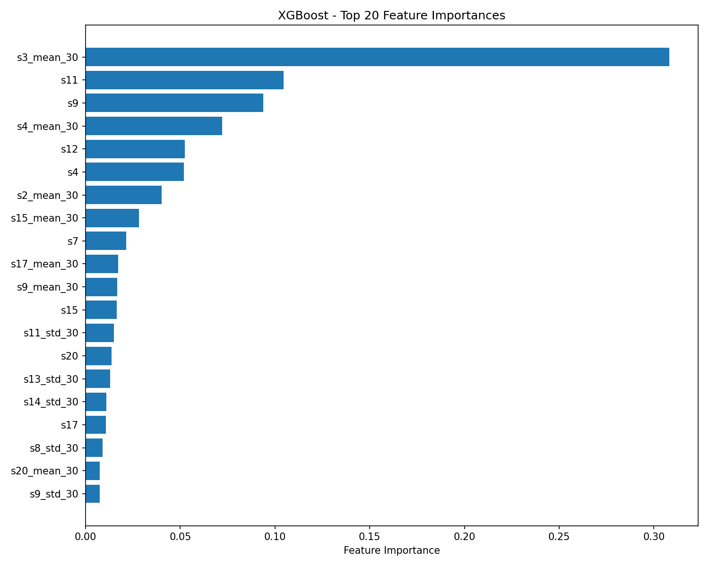

# Turbofan Engine RUL Prediction — NASA C-MAPSS FD001

A predictive maintenance project predicting Remaining Useful Life (RUL) of turbofan engines using the NASA C-MAPSS FD001 dataset. Three models are implemented and compared: XGBoost, LSTM, and 1D CNN, with full experiment tracking via MLflow.

---

## Dataset

### Download the dataset
Download the CMAPSS dataset from the [NASA Prognostics Data Repository](https://www.nasa.gov/intelligent-systems-division/discovery-and-systems-health/pcoe/pcoe-data-set-repository/) and place the FD001 files in a `CMAPSSData/` folder in the project root.

NASA C-MAPSS (Commercial Modular Aero-Propulsion System Simulation) FD001 subset:
- 100 training engines run to failure
- 100 test engines cut off at an unknown point before failure
- 26 columns per row: engine ID, cycle, 3 operational settings, 21 sensor readings
- Single operating condition, single fault mode

RUL targets are capped at 125 cycles following the piecewise linear convention established in the C-MAPSS benchmark literature (Heimes 2008, Li et al. 2018), reflecting the assumption that sensor data beyond this horizon carries no reliable prognostic signal.

---

## Results

| Model | Epochs | RMSE | NASA Score |
|-------|--------|------|------------|
| XGBoost | — | 18.09 | 663.97 |
| LSTM | 50 | 15.87 | 545.85 |
| LSTM | 100 | 18.00 | 551.98 |
| 1D CNN | 50 | 15.16 | 325.63 |
| 1D CNN | 100 | 15.03 | 359.89 |

Lower is better for both metrics. The NASA scoring function penalizes late predictions (underestimating RUL) more heavily than early ones, reflecting the safety-critical nature of engine maintenance.

Best results: 1D CNN at 50 epochs (RMSE: 15.16, NASA Score: 325.63)

---

## Key Findings

**Sensor analysis:** 7 of 21 sensors were dropped due to near-zero variance, they carried no degradation signal. The remaining 14 sensors all showed meaningful correlation with RUL, with s11, s4, s12, and s7 being the strongest individual predictors.

**Feature importance:** Rolling mean of s3 over 30 cycles was the single most important XGBoost feature, despite s3 not being the top correlated raw sensor. This highlights the value of smoothed trend features over instantaneous readings for tree-based models.

**CNN vs LSTM:** The 1D CNN outperformed the LSTM on both metrics across all runs. The CNN also trained more stably, loss decreased consistently from epoch 1, whereas the LSTM was stuck until around epoch 25–30 before converging. This is consistent with findings in the C-MAPSS literature where CNNs tend to match or beat LSTMs on FD001.

**Epoch sensitivity:** Both models showed diminishing returns beyond 50 epochs. The LSTM degraded slightly at 100 epochs (RMSE 18.00 vs 15.87), while the CNN remained stable (15.03 vs 15.16). The CNN at 50 epochs achieved the best NASA score (325.63), suggesting extra training improved average error slightly but introduced more late predictions.

**Normalization matters:** Without MinMaxScaler normalization, the LSTM loss did not decrease across 50 epochs (stuck at ~1747). After normalization, loss dropped sharply, demonstrating the sensitivity of gradient-based models to feature scale.

## Methodology

### Data Preprocessing
- 7 sensors dropped due to near-zero variance (s1, s5, s6, s10, s16, s18, s19)
- RUL target engineered from cycle-to-failure with piecewise linear cap at 125
- Rolling mean and std over 30-cycle window added per sensor (28 additional features)
- MinMaxScaler normalization applied before deep model training

### Models

**XGBoost** trains on a tabular snapshot, the last cycle per engine with 42 features (14 sensors + 28 rolling features). No sequence structure, no normalization required.

**LSTM** processes sequences of 30 consecutive cycles, learning temporal dependencies across the degradation trajectory. 2 layers, hidden size 64, dropout 0.2.

**1D CNN** applies two convolutional layers across the time dimension followed by global average pooling, capturing local temporal patterns. 64 filters, kernel size 3, dropout 0.2.

Both deep models use sliding window sequence preparation, each training sample is a 30×42 matrix representing 30 consecutive cycles for one engine.

---

## How to Run

### Install dependencies
```bash
pip install -r requirements.txt
```

### Train models
```bash
python train_baseline.py
python train_lstm.py
python train_cnn.py
```

### Generate plots
```bash
python plot_results.py
python plot_importance.py
```

### View MLflow experiments
```bash
mlflow ui
```
Then open http://127.0.0.1:5000

Hyperparameters can be adjusted in `configs/config.yaml` without modifying any source code.

---

## Plots

### Predicted vs True RUL — CNN vs LSTM


### XGBoost Feature Importance


---

## Limitations and Future Work

- Only FD001 subset evaluated. FD002/003/004 include multiple operating conditions and fault modes, requiring more sophisticated normalization
- No cross-validation. results are on a single train/test split
- Hyperparameters not tuned. grid search or Optuna would likely improve all three models